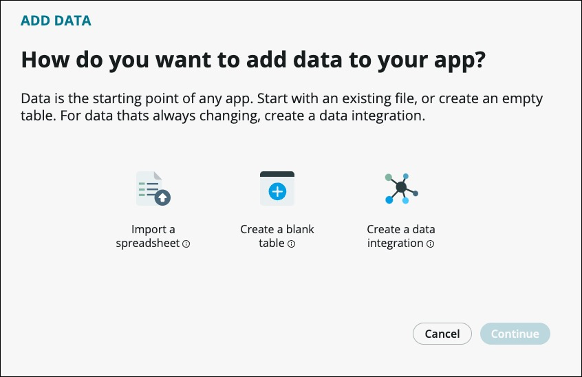
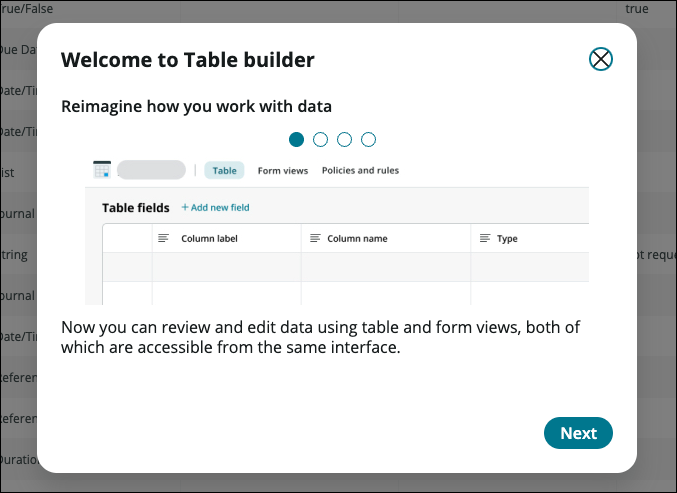
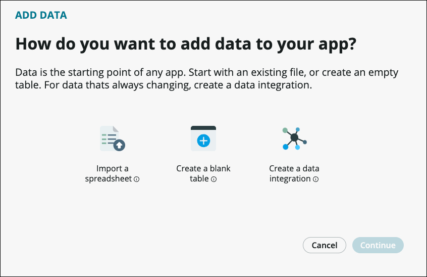
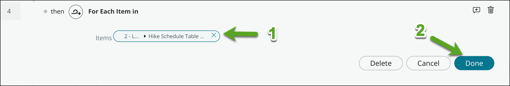
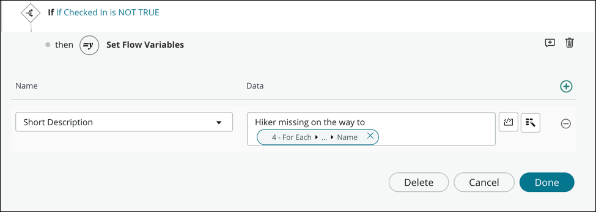

In the verdant hills of Middangeard National Park, a company of hikers had set out on a grand adventure. The lush forests and rolling meadows were a sight to behold, but perilous obstacles lurked just beyond the treeline.

As they made their way deeper into the woods, the hikers soon realized that they were not alone. The sounds of rustling underbrush and the occasional growl of a wild beast filled the air. But with the help of modern technology and the power of automation, these brave souls could traverse the park with ease and safety.

Enter the Magically Transform a System of Record with Automation lab, where you will learn how to harness the power of automation to transform your system of record into a nimble and efficient machine. With the help of our expert guides and cutting-edge tools, you will be able to navigate the rugged terrain of Middangeard National Park with confidence and ease.

From automating mundane tasks to managing complex workflows, this lab will equip you with the skills and knowledge you need to stay ahead of the game. So join us, brave hiker, and let us help you conquer the wilds of Middangeard National Park!

# Exercise 1: Create a Hike Schedule Table with a Calculated Field

## Goal

In this lab, we will be focusing on creating a new table to track the arrival times of hikers at different locations. This is important because it allows us to keep track of their progress and determine if any assistance is needed. To achieve this, we will be using ServiceNow's new formula builder capability to determine the time it takes each hiker to go from starting point to destination. Eventually, this functionality would enable us to automate the calculation of arrival times based on various factors such as distance, elevation, and estimated speed.  However, for this minimum viable product (or MVP) a simple calculation will suffice. Ultimately, the success of our hiking expedition will depend on the accuracy and reliability of this new table.

1. Log in to your instance.

1. Click the **All** menu navigation button in the top left corner of your instance.

1. Search for **App Engine Studio**.

1. Click **App Engine Studio**.

    

1. Open the **Hobble-a-Ton Hiking** app by clicking on the tile under **My recent apps**.

    

1. Click the **+Add** link in the Data section of your App

    

1. Click the **Create a Blank table** link

    

1. Click **Continue**.

1. Click the **Create from an extensible table** link

    

1. Click **Continue**.

1. On the screen titled *Which table do you want to use?*, in the **Table (1)** field, select *Task* (it will be the first one listed under *Recommended Tables*)

1. Click **Continue (2)**.

    

1. Enter the following information to create your table.

    |Step|Field|Value|
    |----|-----|-----|
    |1|Table label|Hike Schedule Table|
    |2|Auto number|(checked)|
    |3|Prefix|HSCHD|

    

1. Click **Continue**.

1. Set the following values to grant the ADMIN role the ability to do **C/R/W/D** while only allowing the USER role the abilty to **C/R/W** and press the Contune button.

    

    > The next screen that loads, titled Your table is ready, signifies that your table has been successfully created. However, we can see from the Fields (1) counter that we haven't created any.

1. Click Edit table (2) so we can add our fields.

    

    >The system presents the Table Builder for the Trail Check-In table and a helpful pop-up titled *Welcome to Table builder*.

1. Click ⓧ in it's upper right-hand corner to close.

    

    >Here, we see all of the fields and their settings that currently exist in our Trail Check-In table, each represented as a row. While we can see there are a few default fields, none are appropriate for storing the name of our Trail Check-Ins.

1. Click **+ Add new field**.

     

     The system creates a new, blank row.

1. Fill in the following values for each of the new **Hike Number** field's settings.

    | Field | Value |
    |--|--|
    |Column label|Hike Number|
    |Column name|hike_number|
    |Type|Reference|
    |Reference|Hike|
    |Max length||
    |Default value||
    |Display|Leave Toggled Off|

    > **What Does the *Display* Setting Do?** The Display option on a table's field indicates that if you are referencing records from another table (e.g. list), that is what will be shown to reference each record. For example, on the User table, the Display field is the person's full name versus something that wouldn't be helpful like employee ID.

1. Click **Add new field** again and fill in the following values for the field's settings.

    | Field | Value |
    |--|--|
    |Column label|Check In Name|
    |Column name|check_in_name|
    |Type|Reference|
    |Reference|Trail Check-In|
    |Max length||
    |Default value||
    |Display|Leave Toggled Off|

1. Repeat the previous step with the following settings to create five more fields.

    | Field | Value |
    |--|--|
    |Column label|Check In Order|
    |Column name|check_in_order|
    |Type|Integer|
    |Reference||
    |Max length||
    |Default value||
    |Display|Leave Toggled Off|

    | Field | Value |
    |--|--|
    |Column label|Hike Start Time|
    |Column name|hike_start_time|
    |Type|Date/Time|
    |Reference||
    |Max length||
    |Default value||
    |Display|Leave Toggled Off|

    | Field | Value |
    |--|--|
    |Column label|Hours To Check In|
    |Column name|hours_to_check_in|
    |Type|Duration|
    |Reference||
    |Max length||
    |Default value||
    |Display|Leave Toggled Off|

    | Field | Value |
    |--|--|
    |Column label|Planned Check In|
    |Column name|planned_check_in|
    |Type|Date/Time|
    |Reference||
    |Max length||
    |Default value||
    |Display|Leave Toggled Off|

    | Field | Value |
    |--|--|
    |Column label|Checked In|
    |Column name|checked_in|
    |Type|True/False|
    |Reference||
    |Max length||
    |Default value||
    |Display|Leave Toggled Off|

1. Click **Save** in the top right corner to save your work.

1. Locate the *Filter options* and select **Hide extended fields**.

     

1. Your table should look like this:

     

     >Verify your seven fields are created as expected.

    >For our hikers, the check in points are spaced out 2 hours from each other. In order to calculate the Hours To Check In we will create a formula using **Formula Bulder** which takes the Order of the Check In Point and multiples it by 2.

1. Hover over the **Hours To Check In** Column Label and click the **Gear** icon to open the Side Panel.

     

    >The Side Panel opens on the right side.

1. Expand the **Formula Section** to add a formula.

     

1. Click **+ Add**. A new modal appears in the middle of the screen (seen below.)

     

    >To create a formula you can simply start typing the column label and a full selection of labels matching your text entry begin to display.

     

1. Enter the following formula - **check_in_order * 2**

     

1. Click **Submit**.

1. Click **Save** in the top right corner to save your work.

    >For the sake of time, we will verify this function works in the next Section where we create the Flow which generates these check ins.  

    >Now that we have created our *Hike Schedule Table* lets make the list and forms look better for the users to interact with.

1. Navigate back to the **App Home** tab.

1. Click the **Preview** link on the *Hike Schedule Table* line.

     

    >A new tab opens displaying a less than useful view of the **Hike Schedule Table**.

     
1. Click the Cog icon in the top right corner (1) and then click **Reset to column defaults** (2) and OK to exit this pop-up.

     

1. To change the columns being listed in this view, Hover over the **Number** header header and click the 3 dots which appear(1). Click **Configure** (2). Click **List Layout** (3).

    

1. Remove all the existing columns from the **Selected** box *except* **Number**.

1. Select the following fields from *Available* by double clicking, or single click and use the arrow to move them to the *Selected* column (1).

    * Hike number
    * Check In Order
    * Check In Name
    * Hike Start Time
    * Hours To Check In
    * Planned Check In
    * Checked In

1. Click **Save**(2).

    

1. Your new list layout will now display much more relevant data.

    

    Congratulations! In this lab, we accomplished the creation of a new table to track the arrival times of hikers at various locations. We utilized ServiceNow's formula builder capability to automatically determine the value of one of the columns. The successful completion of this task is critical for the accurate tracking of hiker progress and determining if any assistance is required. By creating this new table and using ServiceNow's functionality, we have effectively streamlined the tracking process and improved the efficiency and reliability of our hiking expedition.

# Exercise 2: Populate the Hike Schedule Table whenever a new hike is created

## Goal

Welcome to Exercise 2.  In this exercise we will automate the process of populating a *Hike Schedule Table* with check-in times when a new hike is created. This functionality will be used for safety monitoring purposes.

In this lab, you will learn how to leverage the power of Flow Designer, an intuitive drag-and-drop interface, to design a workflow that automates the creation of check-in times in the Hike Schedule Table. You will also be introduced to the powerful capabilities of App Engine Studio, which allows both No Coders and Pro Coders to work together on the same project, making collaboration between team members easier than ever before.

By the end of this lab, you will have gained valuable experience in using Flow Designer and App Engine Studio, and you will have learned how to automate a critical safety monitoring process in your application. So let's get started!

1. To navigate back to the *App Dashboard*, click it's tab within App Engine Studio (it will be the first one on the line).

    > Note: Feel free to close the other tabs we had opened to create our table and populate it with records. You can do so by clicking the **X** on the right side of each.

1. On the App Dashboard scroll down to the *Logic and automation* section, then click **⊕ Add** to create a new piece of logic and automation.

     

1. Click the **Flow** tile to create a new Flow.

     

1. The next screen provides some OOTB Flow templates, but we want to **Build from scratch**.

     

1. Let's provide a *Name* and *Decription* for our Flow.

    | Field | Value |
    |--|--|
    |Name|Generate Check Ins|
    |Description|This flow runs whenever a new Hike is registered and creates the individual Check Ins which will be used for safety monitoring.|

    

1. Click **Continue** in the lower rights corner.

    >It's time to edit this flow.

1. Click **Edit this flow** in the lower right corner of the screen.

    

    >The new *Generate Check Ins* flow is displayed.  Since this is a totally blank canvas, we need to create this workflow.

    

    >In order for a flow to run, we must set the *Trigger* which looks for specific events and conditions to occur in order to run the appropriate workflow.

1. Open the *Add a trigger* by clicking **⊕ Add a trigger**.

    

    >We want this workflow to run everytime a record is created in the *Hike* table.  

1. Use the drop down box next to *Trigger* to select **Created** (1), then use the newly displayed drop down box next to *Table* and select our application's **Hike** table.

    > We won't add any conditions at this time.

    

    > Best practice is to add an annotation to all **Actions** so anyone coming into the flow later can see exactly what is going on without expanding the **Action**.

1. Click the **+** next to the *Trash Can* (1) and add the text "*Kick off this workflow whenever a new record is created in the Hike table.*" (2).

    

1. Click **Done** to continue building the workflow.

    >The first thing we need to do is to select all the records from the *Check In* table so that we can use those to populate the individual hiking schedule check ins for this hike.

1. In order to select these records click **⊕ Add an Action, Flow Logic, or Subflow** (1) and then **Action** (2).

    

    

    >ServiceNow provides over 200 pre-built collecions of actions (or spokes) to choose from.

1. Search for **Look up records** and select the action matching that name from the *ServiceNow Core* spoke.

    

    >The following **Look Up Records** is displayed.

    

1. Using the drop down search box next to *Table*, search for and select **Trail Check-In**.  

    

   > Within that table we want to find all the records which are less than or equal to the *Destination Order* from the trigger record **AND NOT** equal to 0.

1. Within the Conditions section select **ORDER** from the fields drop down box (1), select **less than or is** (2), then use the data pill picker icon (3) and navigate through the cascadeed fields to **ORDER** shown.

    

1. We need to add another condition to filter out the Home Base which has an **ORDER** of **0** by creating an **AND** (1) condition which looks like this - **ORDER IS 0** (2).  Your completed condtion should be shown as such:

    

1. The completed **Look Up Records** action should appear as follows:

    

    >  Per best practice, create a useful annotation to be able to quickly see what this action does.  *Grab all Check Ins where the order is less than or equal to the trigger record AND NOT 0.*

1. Save your work by clicking the **Save** button in the top right corner of your flow.

    

    >With this collection of records we will loop thru each record returned while using certain fields to create new records in our **Hike Schedule Table**.

1. In order to utilize these records to create new ones click **⊕ Add an Action, Flow Logic, or Subflow** (1) and then **Flow Logic** (2) >> **For Each** (3).

    

    

    > A **For Each Loop** iterates through a collection until it reaches the end.  In our use case, we will be looping through the records returned in **Action 1**.  
    
1. Drag the **Trail Check-In Records** data pill from the **Data Pane** on the right side of your flow into the **Items** box.

    

    > Add a useful annotation as you have done previously.  *Loop through the Check In Records returned above*.

    > To take action on these records, the actions must be placed **WITHIN** the loop. 

1. Click the smaller **⊕** directly under the **For Each Item In** loop.

    

1. In order to utilize these records to create new ones click **⊕ Add an Action, Flow Logic, or Subflow** (1) and then **Action** under the For Each loop (2).

    

1. One of the most used actions is the **Create Record** action.  Search for it as you did previously for other actions and then select it.

    

1. Select the **Hike Schedule Table**.

    

    >Setting fields onto this record is super easy.  Simply pick the field you want to populate and then set the value onto it by either hard coding it or by using one of the many data pills available to us.  We will populate the following fields using the **Trigger Record Data Pills** and the **Trail Check-In Record Data Pills** which align to these fields.  

    | Field | Value |
    |--|--|
    |Name|Hike Number|
    |Description|Trigger Record >> Hike Record

    | Field | Value |
    |--|--|
    |Name|Check In Name|
    |Description|For Each >> Trail Check-In Record|

    | Field | Value |
    |--|--|
    |Name|Check In Order|
    |Description|For Each >> Trail Check-In Record >>  Order|

    | Field | Value |
    |--|--|
    |Name|Hike Start Time|
    |Description|Trigger Record >> Hike Record >> Planned Start Date |

    

    > Of course there is one more field on the Hike Schedule Table we need to set.  We need to calculate the time when the hiking party is scheduled to check-in to each of the check points along their journey.  To do this, we will **Update** the record we just created so that our calculated field of **Hours To Check-In** has populated.

    

1. For the final time in this flow we will add an action, an **Update Record** action in which we will be using the **Hike Schedule Table** again.  This time, we need to **Add field value** to the **Planned Check-In** field.   Because we have done this before, this is what our **Update Record** section will look like:

    

    > Up to this point, everything we have done in Flow Designer has been **No Code**.  One of the powerful capabilities of App Engine Studio is that **BOTH** No Coders and Pro Coders can work side by side as a team.  In order to populate the **Planned Check-In** we will be adding our calculated **Hours to Check-In** to the **Hike Start Time**.  

    > The ability to add script to a flow is something which can be controlled within the App Engine Management Center, which is not covered in this course.*

1. Click the box with the **< />** graphic on it to expand the scripting section (1).

    

    > Once expanded the scriptiung section offers some helpful hints.

    

1. Delete the existing green text so that the scripting canvas is totally emplty.  The Copy and paste the following script into the newly expanded, blank, scripting section.

    ```javascript
    /* **1) Create a new Date Time variable named start_time to store our Hike Start Time
       **2) Create a new generic variable named Duration to store our Hours to Check-In
       **3) Add duration to start_time
       **4) Return the String representation of our start_time variable
    */
    var start_time = new GlideDateTime(fd_data._3__create_record.record.hike_start_time.getDisplayValue());
    var duration = fd_data._3__create_record.record.hours_to_check_in.dateNumericValue();
    start_time.add(duration);
    return start_time.toString();
    ```

1. You're **Planned Check In** section will look like this:

    

1. Click **Save** to save your flow.

1. Your completed flow should look like this:

    

1. Before we **Activate** this flow we need to test it.  In order to do this, click the **Test** button at the top of the flow.  

    

    >Flow designer allows you to test your flow all from within the Flow Designer interface.

1. The following screen will appear:

    

    > We have the ability to create a record from scratch or use an existing record.  

1. Click the **down arrow** next to the spy glass (1). Select **HIKE0001003** which was preloaded for you in the **Hike** table (2). Click **Run Test** to execute this test case (3).

    

    >While we could click the text *Your test has finished running.  View the flow execution details*, I find when inserting records into a table it is easier to simply navigate to that table to see that the records were created and updated appropriately.  

1. Close out of the **Test Flow** window by clicking the **X** in the top right.

    

1. Navigate back to the main **App Home** tab (1) and **Preview** the **Hike Schedule Table** (2).

    

    >A new browser tab will open showing the following records were added to the **Hike Schedule Table** and the **Planned Check In** column is filled with the appropriate times the hiking party should get to each location.

    

1. With these Hike Schedules created we need to ensure that the **Hike** detail form shows these associated records.  Click on one of the **Hike Numbers** to open the *Hike Number Form* to open the detail page for that Hike.

    

1. To display these **related** records, Right Click in the grey area at the top of the record (1). Select Configure(2). Then select **Related Lists** (3) to disply the following:

    

1. Scroll down to **Hike Schedule Table->Hike Number** and **double click** on it to move it to the **Selected** box (1).  Then click **Save** (2).

    

    > When you are taken back to the **Hike** detail page you will see your related **Hike Schedules** at the bottom of the form.

    

    In this lab, you learned how to use Flow Designer and App Engine Studio to automate the process of populating a Hike Schedule Table with check-in times whenever a new hike is created. 

    This functionality was designed to be used for safety monitoring purposes. You leveraged the intuitive drag-and-drop interface of Flow Designer to create a workflow that automated the creation of check-in times in the Hike Schedule Table. You also learned about the powerful capabilities of App Engine Studio, which allows both No Coders and Pro Coders to work together on the same project, making collaboration between team members easier. By the end of the lab, you gained valuable experience in using Flow Designer and App Engine Studio and were able to automate a critical safety monitoring process in their application.

    Our Hikers feel safer already!

# Exercise 3: Create Emergency Tasks when a Scheduled Check In has been missed.

## Goal

In this lab, you will learn how to use ServiceNow's App Engine to create an emergency task table, where emergency tasks will be created automatically when a scheduled check-in is missed. This will enable our hiking company to respond quickly in case of an emergency situation.

<!--You will also learn how to convert a portion of a flow into a subflow that can be reused in different parts of your application. This will save you time and effort by allowing you to reuse the same logic in different parts of your application without having to recreate it every time.-->

By the end of this lab, you will have gained valuable experience in using ServiceNow's App Engine, Table Builder, Flow Designer, and Flow Variables. So let's get started and ensure the safety of our hikers!

1. Back on the App Home screen, Click the **+Add** link in the Data section of your App

    

1. Click the **Create a Blank table** link.

    

1. Click **Continue**.

1. Click the **Create from an extensible table** link

    

1. Click **Continue**.

1. On the screen titled *Which table do you want to use?*, in the **Table (1)** field, select *Task* (it will be the first one listed under *Recommended Tables*)

1. Click **Continue (2)**

    

1. Set the **Table Label** to **Emergency Task**, Check **Auto Number**, and set the **Prefix** to **EMT**.  Click Continue.

    

1. As we did before, set your permissions to allow the admin full rights while only allowing the user role to Create/Read/Write.  Click Continue.

    

1. **Edit Table**

    

    > In this case, we will only be adding one additional field to associate these Emergency Tasks with the main **Hike** recoerd.  This will allow us to add a related list to the **Hike Detail** page showing all Emergency Tasks associated to that Hike.  

1. Filter the table view to **Hide Extended Fields**.

    

1. Add a new **Reference Field** named **Hike Number** which references the **Hike** table.  Save your work.

    

1. Click **Preview** to open the list view so we may add relevant columns to make the list more useful.

1. Click the Cog icon in the top right corner (1) and then click **Reset to column defaults** (2) and OK to exit this pop-up.

     

    >Just like the last section, let's **Configure List Layout**.

    

1. Select the following fields to display in the list and click **Save**.

    

1. Your list should look like this.

    

    >With our newly created **Emergency Task Table** we need to add another related list to our **Hike Table** so that these **Emergency Tasks** are easily identifiable from the main Hike Record. 

1. To do this, Preview the **Hike Table** from the main **App Home** screen and click on **HIKE0001003**.

    

1. **Configure>Related Lists** by Right Clicking in the grey bar at the top of the detail page and bring over to the **Selected** box **Emergency Task->Hike Number**.

     

    > Upon clicknig **Save** you are brought back to the **Hike** detail page with the new added tab for **Emergency Tasks** being displayed at the bottom of the form.

     

1. Close the browser tab with the **Hike** detail page displayed and return to the **App Home** page.

    >Now that we have created our **Emergency Task Table** we will create a flow which monitors the **Hike Schedule Table** and waits for the duration of the planned hike, then checks to see if the hiker has checked in.  If they have not, an **Emergency Task** is opened and assigned to an Emergency Team to investigate.  If they have checked in, the flow will close itself out.

1. By now you are familiar with how to create a flow.  *Hint* Click the **Add** link next to **Logic and Automation**, then Select Flow.

1. Let's **Name** our flow - **Monitor Hike Schedules** and have a description of - **Check to see if the hiking party has checked in at their destination each step of the way.**  Click **Continue** to proceed to the next step.

     

1. **Edit this flow** so we can set the **Trigger** to kick off everytime a new record is created in the **Hike Schedule Table** and click **Done**.

     

1. In order to **Wait For a Duration of Time** we need to add the **Flow Logic** to do so.

     

1. The **Wait For a Duration of Time** action allows you to specify an **Explicit Duration** (1).  Because we calculated the **Hours To Check In** in the first flow and added it to the **Hike Schedule** we will use that duration from the **Trigger Record**.  To do so, we need to drag the **Hours To Check In** in to the **Wait for** area (2).  Of course, we want this to run **24X7** and will set that appropriately in the **During the following schedule** drop down (3). After verifying your **Wait For** looks like the image below, Click **Done** to proceed.

     

1. Add an **Annotation** to describe what is happening in this **Wait For**. Ex) *Wait for the set duration on this Hike Schedule record.*

    >Once this time expires, we will pull the trigger record again and check if the hiker has checked in. If they have **NOT** we will open an **Emergency Task** and set the **Assignment Group** and **Short Description**.  If they **HAVE** checked in the flow will end.  
    
    >Using the skills you learned in the previous section, add an **Action** to **Look Up Records**. *Be sure to select the **PLURAL** action ending in **RECORDS***.

1. Configure the newly created **Look Up Records** so it matches this image.  The table selected is our **Hike Schedule Table** and the *Condition* we are looking for is where the **Number** on the record equals the **Number** from the **Trigger Record**  When finished, click **Done**.

     

1. Add an **Annotation** to describe what is happening in this **Look Up**. Ex) *Look up the record which matches the record being passed in to see if the hikes has checked in*

1. We may or may not have a record.  Let's check directly below the **Look Up** action (1).  **If** we **DO NOT**(2) (Count = 0)(3) it means our Hikers are checked in and enjoying their trip.  If we **DO** have a record (Count <> 0) it means our Hikers are behind and we need to send someone to look for them.  

     

    > Time to proceed if we **DO** have a record.  

1. Under the **If** statement we will add a **For Each** loop to loop through **EACH** record returned and does something.  This will be added using the **+** next to **then**

     

1. Drag the **Look Up Records** returned from the 2nd Action into the **Items** box (1) and cick **Done** (2).

     

    >At this point, we have waited the amount of time specified for this Hike Schedule and have pulled back the original record to check if the hikers have checked in.  
    
    >We need to create a logical **IF** statement and set the **Condition** to look at the **Checked In** value from the **For Each** record and see if it **IS NOT TRUE**  

     

    >When this happens we will create a task, assign to the emergency response team, and provide a useful description.

1. Add a **Create Record** action under our new **For Each**.

     

1. We will be creating the record in the **Emergency Task Table** and setting the **Hike Number** to the **Hike Schedule Table Record >> Hike Number ** from the **For Each** by dragging the entire data pill into the box next to **Hike Number**.  Additionally, set the **Assignment Group** to **Incident Management** and setting the Short Description to **Hikers missing on the way to** (1) and then navigate to the **Name** field (2) within the recoed we are using from the **For Each** loop.

     

1. Your **Create Emergency Task Record** action should look like this:

    

    > Before we proceed, we should test our flow.  Of course, we dont want to wait 2 hours to see if a task was created for a Hike Schedule.  

1. We should modify the **Wait** action fropm using the data pill to a hard coded, **5 SECONDS**

    

1. Next, click the **Test** button at the top of the screen.

    

1. Click the **Drop Down Box** (1) and select one of your Hike Schedules (2).  (*Be sure to remember which one.*) and then click **Run Test** (3).

    

1. A new link appears in the modal which lets you know your test has completed.  Click that link.

    

1. The page that opens would look similar to this.  If your flow is still waiting for the Timer to complete, click the **Refresh** icon at the top of the flow next to **Open Flow**.  Your page should look like this:

    

1. Close this execution tab and navigate back to your **App Home Tab**.

1. We need to check to ensure the **Emergency Task** was opened on our **Hike Record**.  Because we used a **Hike Schedule Record** to test, we should **Preview** the **Hike Schedule Table.**

    

1. A new tab opens showing the records on the **Hike Schedule Table**.  We want to open the **Hike Number** associated to the **Hike Schedule** we used to test.

    

    > We are now viewing the parent **Hike Record** which holds **BOTH** our **Hike Schedules** and our newly created **Emergency Task**.

    

1. Click on the **Emergency Task** tab to confirm a new task has been created, the appropriate short description has been populated, and the task has been assigned to the **Incident Management** group.  

    

<!--
    > Take a second and pat your self on the back for helping ensure our hikers will be well looked after and monitored on their way through the shire.

    >One of the most exciting new features in the Utah release of Flow Designer is the ability convert consecutive items of a flow into a new subflow that preserves data pill references between the converted items. Update the original flow to replace the converted items with a call to the new subflow.  This subflow can then be reused to ensure there is a standard way of doing something.  Let's give that a shot!

    >In order to maximize reusability, **subflows** take data pills.  That means we need put the beginning part of our Short Description into a flow wariable so we can pass that into the **subflow** we will create.
-->
    
> Similar to Workflow scratchpad variables, you can create variables that can be used and modified directly in your flow. Even better, you can access flow variables as data pills directly in the Data panel. 

43. To create a flow variable, click the **thee dots** in the top right corner of the flow (1) and select **Flow Variable** (2).

    

1. Click the **+** to create a new **Flow Variable** (1) and enter the values in the screen shot below (2) and then **X** out of this pop up (3).

    

    >With our new **Flow Variable** created, let's put the beginning part of our Short Description into the flow wariable we just created.  

1. To do this, hover your cursor just above the "now" logo next to "Create Emergency Task Record".  You will see a + appear, which we will click.

    

    >Setting a value into our Flow variables is part of the **Flow Logic** set of options.  

1. Click **Flow Logic** (1) and scroll down to **Set Flow Variable** to select it (2).

    

1. As we did before, click the **+** to bring open a dialogue box containing the **Flow Variables** available to us.

    

1. (1) Select our **Short Description** variable (1), Type in *"Hiker missing on the way to "* (2) and then (Drag the **4-For Each -> Hike Schedule Table Record -> Check In Name -> Name** data pill behind our text (3).

    

    >Great Job!!!  Your **Flow Variable** should look like this.  Click **Done** to return to editing the main flow.

    

    >Up next, we will replace the **Short Description** in our **Create Emergency Task Record** to contain our newly reusable **Flow Variable**.  Click the ****Create Emergency Task Record** action to expand the action.

     

1. Delete the existing values being set into **Short Description**.

      

1. To set our newly created **Short Description Flow Variable** all we need to do is to drag it from the top of the **Data** panel on the left side and put it into the box we just removed the contecns from.

      

1. Click **Save** in the top right hand corner of Flow Designer.

    >We have just created a **Flow Variable**, Entered a value which will be dynamic based on the Name of the Location the hiking party is going to, and then passed that **Flow Variable** into our **Action** which is create an **Emergency Task Record**.

    > Let's test our updated flow.
<!--
    >The **Create Emergency Task Record** is an action that we could get some reuse out of as this application is further extended. 

1. Click the **Select Multiple** link at the top of your flow next to **Actions**.

    

    >Once clicked you will see that **Check boxes** have appeared next to all of our steps. 

1. Check the box next to the **Create Emergency Task Record** (1).  Upon checking this box, another new piece of text is displayed, **Operations**. Go ahead and click the icon next to **Operations** (2).

    

1. A new window titled **Convert Actions to Subflow** appears and asks us to name our subflow. Name this Subflow **Create Emergency Task** (1).  Expand the **Inputs** section (2) and enter names for the two **Inputs** this **Subflow** will receive (3).  

    

1. We have named our reusable **Subflow** and have specified what pieces of data will need to be passed to it.  Click **Convert to subflow**.

    

    >>Your new **Create Emergency Task** subflow displays with the **Inputs and Outputs** section expanded.  

    

1. Scroll down to the **Actions** section and open up your **Create Emergency Task Record** (1). The **Create Emergency Task Record** is the same (2) as what was in your original flow. Click Done (3).

    

1. Return the the main flow and take note that our new **Subflow** is already ready and waiting for us.

    
-->
    


52. After clicking Test, Click the **Drop Down Box** (1) and select one of your Hike Schedules (2).  (*Be sure to remember which one.*) and then click **Run Test** (3).

    

1. A new link appears in the modal which lets you know your test has completed.  Click that link.

    

1. From here we can follow the same path we did previously to verify that our new **Emergency Task** is present on the **Hike** record associated with the **Hike Schedule** you used to test.

    

1. With testing completed, we can now **Activate** our **Monitor Hike Schedules** flow so that it is available to our overall application.

    

    In this lab, you learned how to use ServiceNow's App Engine to create an emergency task table and a flow which automatically creates emergency tasks when a scheduled check-in is missed. This feature enables quick responses in case of an emergency situation.

    Additionally, you learned how to create a reuable flow variable. This saves time and effort by allowing the same data to be reused without recreating it every time.

    Throughout the lab, you worked with various ServiceNow tools including App Engine, Table Builder, and Flow Designer, as well as flow variables. By the end of the lab, you gained valuable experience and skills that can be applied to ensure the safety of hikers. 

# Challenge Exercise: Escalate the severity of an Emergency Task which been opened for 24 hours.

## Goal
The goal of this challenge exercise is to use Flow Designer to automatically escalate the severity of an emergency task that has been opened for 24 hours. By creating a new flow or modifying the existing in a way that detects the age of an emergency task and increases its severity level after the 24-hour mark, we aim to ensure that urgent issues are not overlooked and receive the necessary attention and resources to be resolved in a timely manner.  Basically, rescue our hikers!!! The successful completion of this challenge will demonstrate the ability to leverage Flow Designer to streamline emergency task management and improve overall workflow efficiency.


